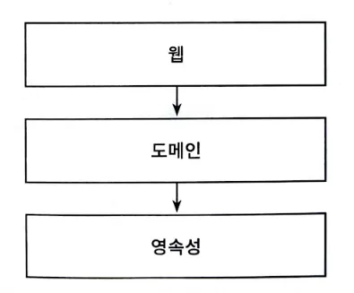
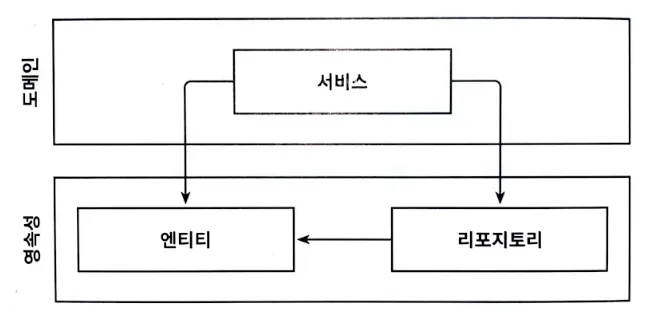
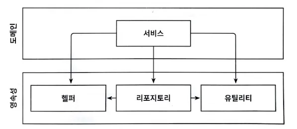
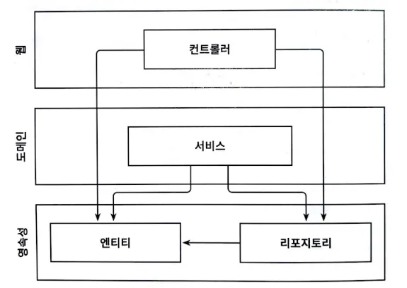
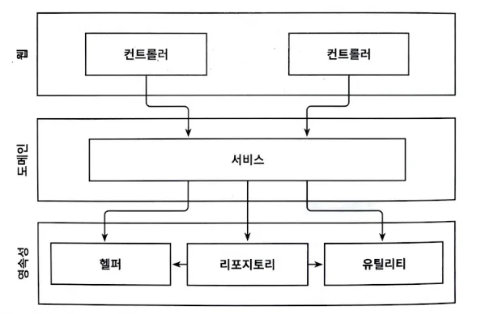

## 01. 계층형 아키텍처의 문제는 무엇일까?

계층(layer)으로 구성된 애플리케이션을 개발해본 적이 있을 것이다. 웹 계층에서는 요청을 받아 도메인 혹은 비즈니스 계층에 있는 서비스로 요청을 보낸다.

> 웹 계층, 도메인 계층, 영속성 계층으로 구성된 전통적인 웹 애플리케이션 구조이다.

서비스에서는 비즈니스 로직을 수행하고, 도메인 엔티티의 상태 조회나 변경을 위해 영속성 계층의 컴포넌트를 호출한다.

계층형 아키텍처를 잘 구성한다면 웹 계층이나 영속성 계층에 독립적으로 도메인 로직을 작성할 수 있다. 도메인 로직에 영향을 주지 않고 웹 계층과 영속성 계층에 사용된 기술을 변경하거나, 새로운 기능을 추가할 수도 있다.

> 잘 만들어진 계층형 아키텍처는 선택의 폭을 넓히고, 변화하는 요구사항과 외부 요인에 빠르게 적응할 수 있게 해준다. 이것이 바로 아키텍처의 전부다.

그렇다면 계층형 아키텍처의 문제점은 무엇일까?

계층형 아키텍처는 코드에 나쁜 습관들이 스며들기 쉽고, 시간이 지날수록 소프트웨어를 점점 더 변경하기 어렵게 만든다.

### 계층형 아키텍처는 데이터베이스 주도 설계를 유도한다

---

웹 계층은 도메인 계층에 의존하고, 도메인 계층은 영속성 계층에 의존하기 때문에 자연스레 데이터베이스에 의존하게 된다.

모든 것이 영속성 계층을 토대로 만들어지지만, 우리는 상태(state)가 아니라 행동(behavior)을 중심으로 모델링한다.

우리는 왜 ‘도메인 로직’이 아닌 ‘데이터베이스’를 토대로 아키텍처를 만드는걸까?

애플리케이션의 유스케이스를 떠올려보자.

- 도메인 로직을 먼저 구현했는가?
- 영속성 계층을 먼저 구현했는가?

아마 데이터베이스의 구조를 먼저 생각하고, 이를 토대로 도메인 로직을 구현했을 것이다. 이는 계층형 아키텍처에서는 의존성의 방향에 따라 자연스럽게 구현했지만, 비즈니스 관점에서는 전혀 맞지 않는 방법이다.

무엇보다 도메인 로직을 먼저 만들어야 한다.

1. 우리가 로직을 제대로 이해했는지 확인할 수 있다.
2. 도메인 로직이 맞다는 것을 확인한 후에 이를 기반으로 영속성 계층과 웹 계층을 만들어야 한다.

데이터베이스 중심적인 아키텍처가 만들어지는 주요 원인은 ORM(object-relational mapping, 객체 관계 매핑) 프레임워크를 사용하기 때문이다.

> 도메인 계층에서 데이터베이스 엔티티를 사용하는 것은 영속성 계층과의 강한 결합을 유발한다.

ORM에 의해 관리되는 엔티티들은 일반적으로 영속성 계층에 둔다. 계층은 아래 방향으로만 접근 가능하기 때문에 도메인 계층에서는 엔티티에 접근할 수 있다. 이렇게 되면 영속성 계층과 도메인 계층 사이에 강한 결합이 생긴다.

서비스는 영속성 모델을 비즈니스 모델처럼 사용하게 되고 이로 인해 도메인 로직뿐만 아니라 즉시로딩(eager loading)/지연로딩(lazy loading), 데이터베이스 트랜잭션, 캐시 플러시(flush)등등 영속성 계층과 관련된 작업을 해야한다.

### 지름길을 택하기 쉬워진다

---

계층형 아키텍처에서 전체적으로 적용되는 유일한 규칙은, 특정 계층에서는 같은 계층에 있는 컴포넌트나 아래에 있는 계층에만 접근 가능하다는 것이다.

> 영속성 계층에서는 모든 것에 접근 가능하기 때문에 시간이 지나면서 점점 비대해진다.

만약 상위 계층에 위치한 컴포넌트에 접근해야 한다면 컴포넌트를 계층 아래로 내려버리면 된다. 그러면 접근 가능해지지만 영속성 계층은 컴포넌트를 아래 계층으로 내릴수록 비대해진다.

### 테스트하기 어려워진다

---

계층형 아키텍처를 사용할 때 일반적으로 나타나는 변화는 계층을 건너뛰는 것이다. 엔티티의 필드를 단 하나만 조작하면 되는 경우에 웹 계층에서 바로 영속성 계층에 접근한다.

> 도메인 계층을 건너뛰는 것은 도메인 로직을 코드 여기저기에 흩어지게 만든다.

이런 일이 자주 일어난다면 두 가지 문제점이 생긴다.

1. 도메인 로직을 웹 계층에 구현하게 된다.
2. 웹 계층 테스트에서 도메인 계층뿐만 아니라 영속성 계층도 모킹(mocking)해야 한다.

이렇게 되면 영속성 컴포넌트에 의존성이 쌓이면서 단위 테스트의 복잡도가 올라가고, 테스트 코드를 작성하는 것보다 종속성을 이해하고 목(mock)을 만드는 데 더 많은 시간이 걸리게 된다.

### 유스케이스를 숨긴다

---

계층형 아키텍처에서는 도메인 로직이 여러 계층에 걸쳐 흩어지기 쉽다.

- 유스케이스가 ‘간단’해서 도메인 계층을 생략한다면 웹 계층에 존재할 수도 있다.
- 도메인 계층과 영속성 계층 모두에서 접근할 수 있도록 특정 컴포넌트를 아래로 내렸다면 영속성 계층에 존재할 수도 있다.

이럴 경우 새로운 기능을 추가할 적당한 위치를 찾는 일은 이미 어려워진다.

> 넓은 서비스는 코드 상에서 특정 유스케이스를 찾는 것을 어렵게 만든다.

계층형 아키텍처는 도메인 서비스의 ‘너비’에 관한 규칙을 강제하지 않아, 시간이 지나면 여러 유스케이스를 담당하는 넓은 서비스가 만들어지기도 한다.

- 넓은 서비스는 영속성 계층에 많은 의존성을 갖게 된다.
- 웹 컴포넌트가 이 서비스에 의존하게 된다.
- 테스트하기 어려워진다.
- 유스케이스를 책임지는 서비스 찾기도 어려워진다.

고도로 특화된 좁은 도메인 서비스가 유스케이스 하나씩만 담당한다면 작업이 더 수월해질 것이다.

UserService에서 사용자 등록 유스케이스를 찾는 대신 RegisterUserService를 바로 열어서 작업하는 것처럼 말이다.

### 동시 작업이 어려워진다

---

경영진은 예산을 들인 소프트웨어가 특정 날짜에 완성되기를 바란다. 특정 날짜까지 소프트웨어가 완성돼야 한다는 것은 여러 작업을 동시에 해야 한다는 것을 의미한다.

계층형 아키텍처에서는 모든 것이 영속성 계층 위에 만들어지기 때문에 영속성 계층을 먼저 개발하고, 그다음에 도메인 계층, 마지막으로 웹 계층을 만들어야 한다. 그렇기 때문에 특정 기능은 한명의 개발자만 작업할 수 있다.

개발자들이 인터페이스를 먼저 정의하고 구현을 기다릴 필요없이 작업할 수 있지만, 데이터베이스 주도 설계를 하지 않은 경우에만 가능하다.

데이터베이스 주도 설계는 영속성 로직과 도메인 로직이 뒤섞여 개별 작업이 어렵기 때문이다.

코드에 넓은 서비스가 있다면 여러 기능을 동시에 작업하기가 어려워진다. 서로 다른 유스케이스를 작업 하면서 같은 서비스를 동시에 편집하는 상황이 발생하고, 병합 충돌(merge conflict)과 롤백 등의 문제가 발생할 수 있다.

### 유지보수 가능한 소프트웨어를 만드는 데 어떻게 도움이 될까?

---

계층형 아키텍처는 많은 것들이 잘못된 방향으로 흐르는 것을 용인한다. 그러나 올바르게 구축하고 몇 가지 추가 규칙들을 적용하면 지름길을 택하지 않고 유지보수하기 쉬운 솔루션을 만드는 데 도움 될 것이다.
